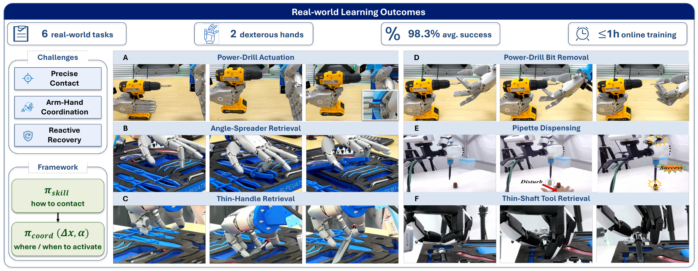

# HiFun

Official code repository for **HiFun: A Hierarchical Framework for Efficient Functional Dexterous Manipulation Learning**, accepted to **CoRL 2026**.



**Code is coming soon.** This repository will host the official implementation. Star this repository to bookmark the project ahead of the release.

[Project website](https://hifun-cfu.pages.dev/)

HiFun learns contact-aware hand skills with residual reinforcement learning and coordinates arm motion and skill activation through real-world human-in-the-loop learning.

## Release status

- Project website: available
- Code: coming soon
- Paper: coming soon

## Citation

```bibtex
@inproceedings{huang2026hifun,
  title = {HiFun: a Hierarchical Framework for Efficient Functional Dexterous Manipulation Learning},
  author = {Huang, Linyi and Huai, Guowei and Liu, Weibin and Jiang, Shulong and Tan, Ping and Zhang, Hui and Song, Jie},
  booktitle = {Conference on Robot Learning (CoRL)},
  year = {2026}
}
```
